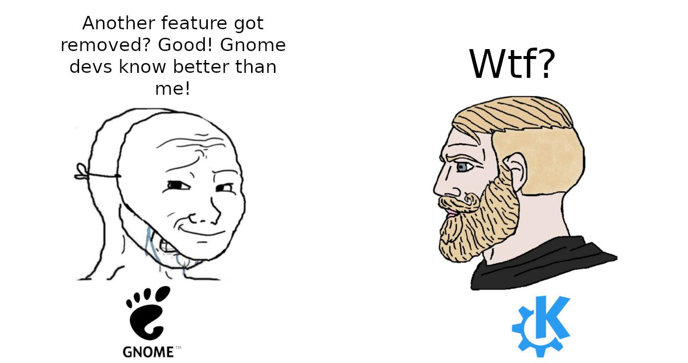

+++
title = 'GNOME и вы'
date = 2025-04-03T16:21:10+03:00
+++

GNOME - один из двух "главных" десктопов (DE) на Linux, вместе с KDE.
Для многих дистрибутивов он же "дефолтный" рабочий стол (Ubunty, Fedora) хотя опять-таки, многие из них
не вносят определенные изменнения (Ubuntu яркий пример), поэтому это не совсем тот GNOME, каким он задуман разработчиками.
После долгих лет скитаний по Linux десктопам сейчас он стал моим основным - начал с GNOME, на нем и закончил (на текущий момент :)).

## I Hate Popular Thing

Несмотря на популярность, GNOME по ощущениям также один из самых нелюбимых проектов для Linux - на то есть ряд причин.

- Пожалуй главная из них - у разработчиков GNOME есть "видение". Это "видение" приводит к тому, что люди открывают issues на тему желаемых фич,
или того, что их не устраивает (тот же трей). Там они получают ответ, что эта идея не соотносится с "видением", и не будет имплементирована - дальше закономерная
драма, переход на личности и т.д.
- GNOME "другой": большинство остальных DE выглядят не так уж отлично от Windows, а Windows - это то, что привычно и понятно для абсолютного большинства людей. Мы не
любим изменять привычки и мозг просит вернуться к прежнему способу работы. Текущий GNOME больше всего напоминает мне планшеты или мобильные устройства (ещё скажите, что
эта черная панель не вызывает ассоциации с IPhone) - и, честно говоря, поначалу такое сходство настораживает. Как мы все прекрасно знаем, то что на мобилках это как на компьютере, только хуже.
- GNOME минималистичен в плане фич, кастомизации, настроек - особенно если сравнивать с KDE - где глобальную тему можно изменить в несколько кликов.
- Не исключено также, что сама по себе "дефолтность" GNOME как рабочего стола приводит к тому, что негативные ассоциации
от работы в Linux неизбежно ассоциируются с ним.

## Этап принятия

Долгое время я находился на стороне людей, которые используют аргументы выше, чтобы доказать, что GNOME не очень.
Но знакомство с дистрибутивом [OpenSUSE Aeon](https://aeondesktop.github.io/) привело волей-неволей к необходимости свыкнуться с GNOME,
так как это единственная опция для Aeon без возможности "правильно" изменить его на другой рабочий стол.
Ограничения вынуждают нас использовать то что есть, и я стал гораздо больше ценить простоту и даже некоторый "минимализм" (относительный, разумеется).

GNOME как полновесный DE что называется plug & play - нужные вещи уже на месте и просто работают.

Был период, когда я активно использовал "оконные менеджеры" (WM) - альтернатива полновесным DE, которые обеспечивают собственно только
управление окнами приложений на рабочем столе (dwm, Hyprland <3). Всё остальное нужно настраивать самостоятельно.
Хочешь другую картинку на рабочий стол? Устанавливай, конфигурируй! Хочешь панель вверху - аналогично.
Хочешь управление гибернацией - см.выше.
Всё это ни в коем случае неплохо, это та свобода, что даёт Linux.
Но иногда нужна свобода и не заниматься всем этим - получить "выбор шефа" на месте и приступить к работе.
GNOME как раз даёт эту возможность. При этом на самом деле мой рабочий процесс значительно не изменился
по сравнению с WM. Тем, кто любит использовать клавиатуру как можно больше есть что предложить.

Ещё одна мысль про тайлинг, который я очень ценил пользуясь WMами. 70% времени у меня 1 приложение на одном рабочем столе. 25% времени - 2 окна ровно посередине.
Остальное - очень редко, настолько, что тайлинг только для такого случая кажется лишним, ведь `command` + стрелочка работают и так неплохо.

## Что стоит понимать про GNOME

Это не овервью, просто пара случайных вещей, которые ускорили моё принятие.

- Не предполагается, что приложения можно свернуть в трей (в дефолтном GNOME вообще нет иконок)
- Приложение, если оно не используется, нужно или выключить, или переместить на какой-нибудь рабочий стол подальше.
- Бесконечная лента рабочих столов - всегда можно добавить новый, это соотносится с пунктом выше.
- `Command` + текст - запустить приложение/найти файл/установить приложение.
- `Command `+ 1,2,3,... - сразу переключается на приложение, закреплённое внизу в доке, где бы оно ни находилось.
- `Command` или `Alt` + `Tab` - переключается между разными приложениями (тут ничего нового)
- `Command` или `Alt` + `~`   - переключается между разными окнами **одного и того же предложения**.
- `Command` + `Shift` + `PageUp/Down` - пихнуть окно на следующий рабочий стол.
- С расширением [Tactile](https://extensions.gnome.org/extension/4548/tactile/) `Command` + `T` расположить окно на экране (тот же "тайлинг").
- [Caffeine](https://extensions.gnome.org/extension/517/caffeine/) - расширение, чтобы управлять уходом компьютера в сон.

Этих команд вообще мне хватает для 95% работы.

## Выводы?

Можно ли сказать, что на текущий день GNOME - это лучшее окружение рабочего стола? Кто-его знает...
В каком-то смысле они все отстой. Но с GNOME определённо можно начать быстро и достаточно продуктивно работать, без `dotfiles`, баш-скриптов и долгих
копаний в конфигах - а это именно то что мне сейчас нужно (ничего не имею против копания в конфигах если что).
Плюс в том, что это один из десятков возможных выборов, и никакие "интересные" решения относительно DE не держат нас в заложниках (привет, Windows).

А вообще эта заметка на самом деле не про GNOME как таковой. Существует великое множество плохих инструментов. Идеальных инструментов (практически) не существует.
Кроме этого остаётся только набор вещей которые приемлимы для каких-то людей, недостатки которых нам не мешают или мы готовы их терпеть. Нет большого смысла в поиске
идеального инструмента для работы, достаточно найти хороший - такой чтобы не было желания прекратить работу и пойти заниматься чем-то другим. Так люди и становятся
Emacs или Vim-волшебниками - они просто наткнулись на них в какой-то момент времени и почему-то не бросили на полпути, но то же может быть верно и про VSCode - достаточно
только проявить любопытство и приложить усилия в освоении своего инструмента.
