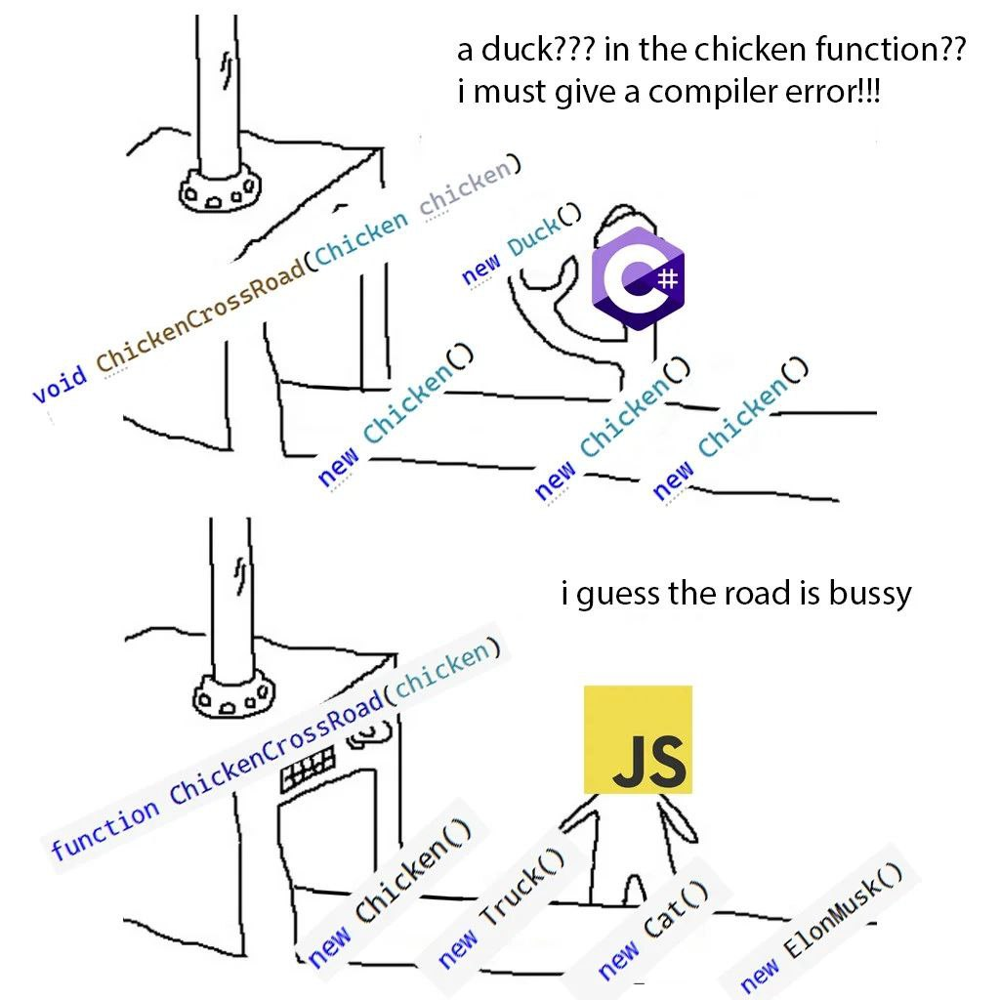

+++
title = 'Логика Хоара и Динамическая типизация'
date = 2024-10-21T21:11:22+03:00
+++

Логика Хоара - это такой очень просто набор логических правил для доказательства корректности компьютерных программ.
У неё есть, в том числе и строгие математические правила и аксиомы, но большинству разрабов она в целом интересна скорее для интуитивного понимания
правильности работы кода.

Простое описание логики Хоара:
{P} C {Q}, где P является предусловием, {Q} - постусловием, а C - команда.
Такое описание ещё называется типлами Хоара.

Корретным будет такой код, для которого при выполнении **предусловия** для всех случаев при выполнении **команды** будет выполняться постусловие.
Важным свойством логики Хоара является композиционность: если мы докажем, что все отдельные инструкции в теле функции корректны, то дальше можно понимать
её корректность в целом, выразив пред- и постусловия (тело функции будет равно команде). 
Так постепенно корректность программы можно сложить из её меньших компонентов.
Этот принцип чем-то напоминает свойство абстракции элементов программы.

Что интересно, если мы сравним доказательство программ на Python с каким-нибудь "душным" языком со статической типизацией и сильной type system,
вроде OCaml, то окажется, что процесс особо ничем не отличается. 
Правильно доказанная логикой Хоара программа на Питоне настолько же корректна как и программа на строгом языке без динамической типизацией.

Всё потому что команда **C** никак не обязана "проверять" каким бы то ни было образом истинность передаваемых предусловий.
Если поступающие в "команду" предусловия истины всегда (или хотя бы в абсолютном большинстве случаев), то при
корректной имплиментации результат на выходе также будет корректным. 
Другое дело, что без хорошой системы типов доказательства будут сложнее, и у нас не остаётся абсолютно никакой страховки.

Что идея типл Хоара может дать простому разработчику, особенно работающему на языках вроде JS или Python?
Думаю, это что простой (для понимания, не всегда для использования :) внести больше уверенности в проекты на таких языках.
В конеце концов и с динамической типизацией могут и даже получаются крупные работающие проекты.
Конечно, в большинстве случаев вряд ли ожидается, что эту логику формально нужно применять в работе для 100% доказательства корректности работы
программы. Но в то же время постоянно задумываясь какое отношение имеет тройка "предусловие - команда - постусловие" к конкретному участку кода
можно сделать код немного безопаснее, например спрашивая себя:

- Как передать в функцию корректные предусловия?
- Следует ли перепроверить правильность полученных предусловий внутри функции?
- Соответствует ли эта реализация функции постусловиям, которые нужно передать дальше по ходу программы?

Надеюсь, я смог убедить кого-нибудь, что используя такую простую ментальную модель в разумных объемах, можно писать более надежный код даже на языках с динамической типизацией.
