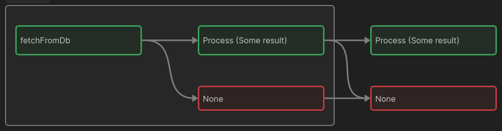

+++
title = 'Галопом по ФП - Монады'
date = 2024-09-12T10:21:34+03:00
draft = false
+++

Долгое время я очень боялся писать хоть что-то про монады, в силу ряда причин:

- Это сложное понятие из теории категорий
- Про это уже было множество статей, роликов заметок и т.д. и едва ли я скажу что-то новое.
- Все эти объяснения, по крайней пере сами по себе, практически не дали мне никакого внятного понимания.

Да, видимо есть что-то в монадах, что мешает объяснить их по простому, хотя бы для начального понимания.
При этом попытки объяснить часто начинаются вообще с разных подходов, нам говорят:

- Монада -- это то, что реализует операцию `flatMap`.
- Монада -- это **моноид** в категории эндофункторов (это фраза уже превратилась в мем).
- Монада -- это составной тип, который определяет 2 операции: `return` (или `unit`) и `bind` 
(монадический биндинг, также обозначается символом >>=).
- Монада -- это буррито (самозаворачивающееся и саморазворачивающееся :)).

И всё таки есть несколько моментов, которые заставляют меня попробовать всё же
подступиться к этому термину с разных сторон, покружить вокруг в надежде, что с нескольких
заходов можно хотя бы подступиться к правде:

- Монады полезны, и часто делают жизнь программиста легче.
- Некоторые известные типы-монады не слишком сложны в понимании (например `Option`, она же `Maybe`).
- Многие наверняка уже сталкивались с ними, или даже писали их, возможно даже не представляя, что это и есть монады.

Так что да, данное объяснение ни на что особо не претендует, кроме может быть "мягкого" введения в тему,
да и найти объяснения мы попробуем из разных источников.

В [посте про моноиды]() уже упоминался
замечательный доклад Скотта Влашина, где он в том числе упоминает и Монады.

Там предлагается понимать их как цепочки продолжений:



в этом смысле Монада создаёт второй параллельный поток при выполнении цепочки операций,
где, например, может возникнуть проблема (исключение). Когда поток вычислений сходит с рельсов на 
красный маршрут, следующий этап выполнения просто передаст дальше что вычисления не завершились
успехом, и нам не нужно как-то отдельно обрабатывать каждый этап.

Таким образом, мы решаем проблему так называемой "пирамиды судьбы" (pyramid of doom), когда на каждом этапе
выполнения операций нам нужен новый `if` для проверки того, не закончилась ли она плохо,
и эти "ифы" очень быстро накапливаются, превращаясь в своего рода треугольник.
Здесь же начинает играть роль смежный, так называемый "голливудский принцип": не звоните нам, мы сами 
позвоним. Это значит, что хорошо бы, чтобы функция не "решала сама", что ей делать в случае
тех же исключений (это еще и нарушение принципа SRP), но вместо этого это мог сделать
программист "снаружи".

Всё эти принципы легко могут быть реализованы при помощи монады `Option` (чуть ниже мы посмотрим,
как она рабтает).

Монада -- это составной тип, т.е. тип который может включать в себя значения других типов.
Т.е. это функтор, но обычный функтор реализует функцию `map`, которая позволяет "извлечь" значение
из "коробочки" типа, произвести над ним действия, и положить обратно внутрь **той же коробочки**.

Так вот, монада -- это это более мощный функтор, так как он реализует `flatMap`.
Обе эти операции очень схожи, но их главное отличие, что `map` принимает функцию, которая
преобразует данные без изменения функтора, в котором он "лежит", а `flatMap`
принимает функцию, которая возвращает значение, упакованное в "новый" функтор:

Например:
- map: (int -> int)
- flatMap: (int -> Some int)

Так как монады это еще и моноиды, они обладают всеми их особенностями: помните как работает
flatMap в то же JS? На определённом этапе мы преобразуем отдельные элементы в списки, 
он затем они всё равно "раскрываются" или "складываются" до единого списка. Это свойство
аппликативности. Также Монады наследуют все преимущества моноидов, как например легкость
распараллеливания, составление из значений цепочек операций и т.д.

И да, `flatMap` и `bind` это абсолютно одно и то же.

Посмотрим теперь на монаду `Option`:

```ocaml
(* Здесь мы впервые упаковываем значение в монаду, если это требуется  *)
let return v = Some (v)

(* Здесь мы применяем функцию f к значению, и возвращаем
   либо "что-то" Some (f v), либо ничего None  *)
let bind f opt =
	match opt with
	| Some v -> Some (f v)
	| None -> None

(* И так можно выстраивать цепочки действий, на любом этапе
   все эти doSmth могут вернуть либо Some (v), либо, при неудаче None
   Монада позволяет тянуть эти значения дальше до конца за счёт собственного устройства *)
let example input = 
	doSmth input
	|> bind doSmthElse
	|> bind doThird
	|> bind (fun z -> Some z)
```

Ещё монады -- это один из немногих способов реализации побочных эффектов в чисто-функциональных ЯП,
вроде Haskell. 
Всё дело в том, что побочный эффект может быть своего рода "встроен" в тип,
а спусковым крючком для его выполнения будет "упаковка" значения в "обертку" в виде монады,
при выполнении операции `bind` (скажем, "при каждой "упаковке в процессе обработки ответа от сервера
можно запиши в лог результат", или как мы рассмотрели выше, также можно управлять побочными эффектами
в виде исключений). 
Таким образом, выполнение побочных эффектов "скрыто" от прямого
использования программистом, но вместо этого элегантно привязано к потоку вычисления функций.

Надеюсь, эта заметка показала, что даже с неполным пониманием всех особенностей понятия Монад,
это всё ещё мощный инструмент в руках программиста, который вполне можно использовать
там, где это логично и удобно. Мы только  коснулись этой темы, и думаю поверхностно
мы к ней ещё вернемся в следующих постах.


